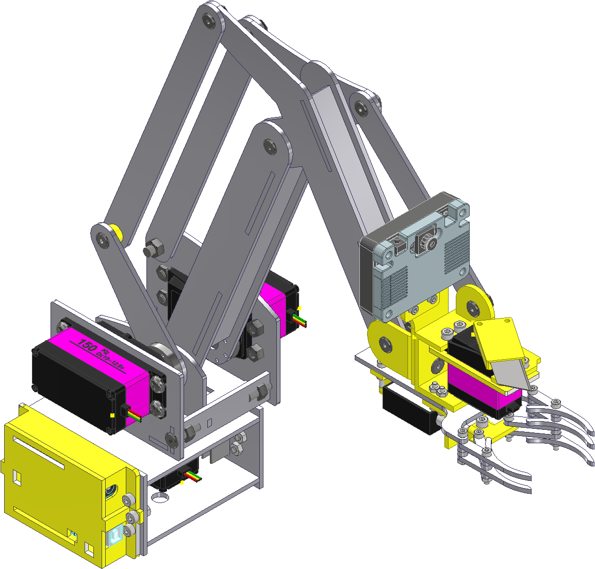
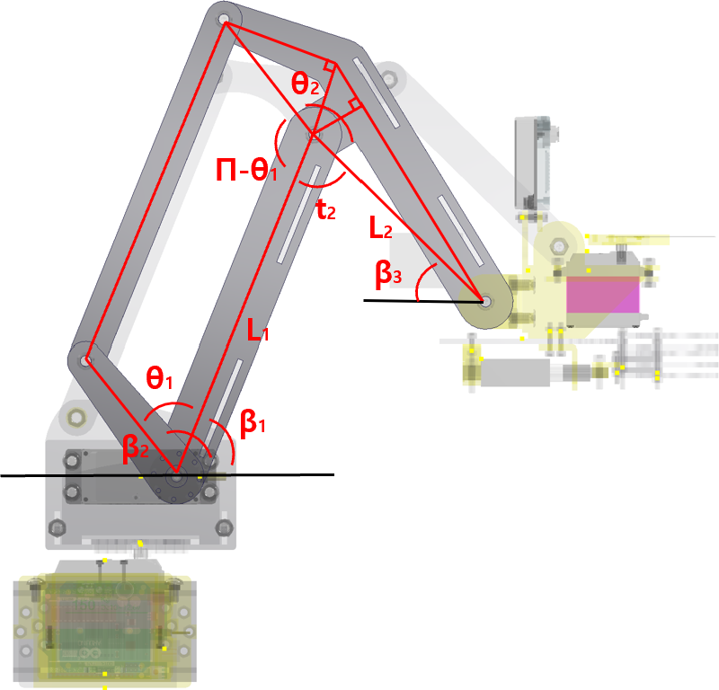
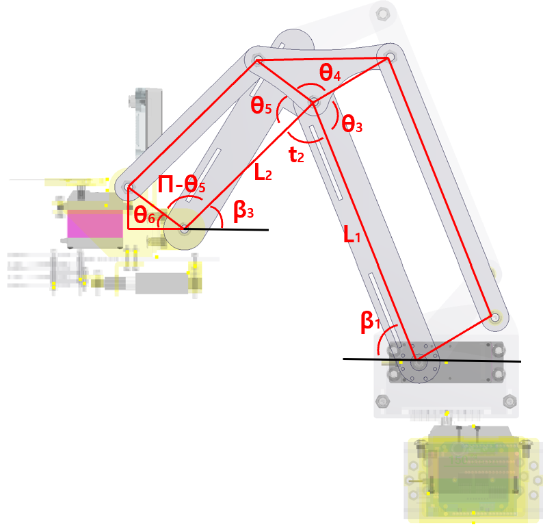
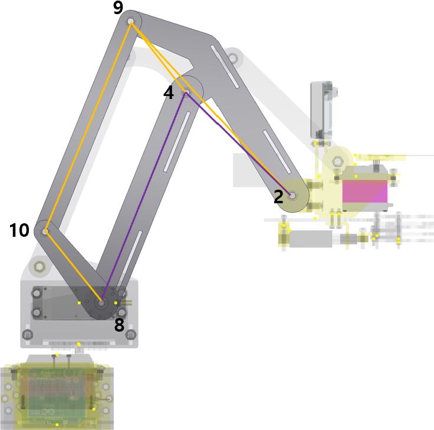
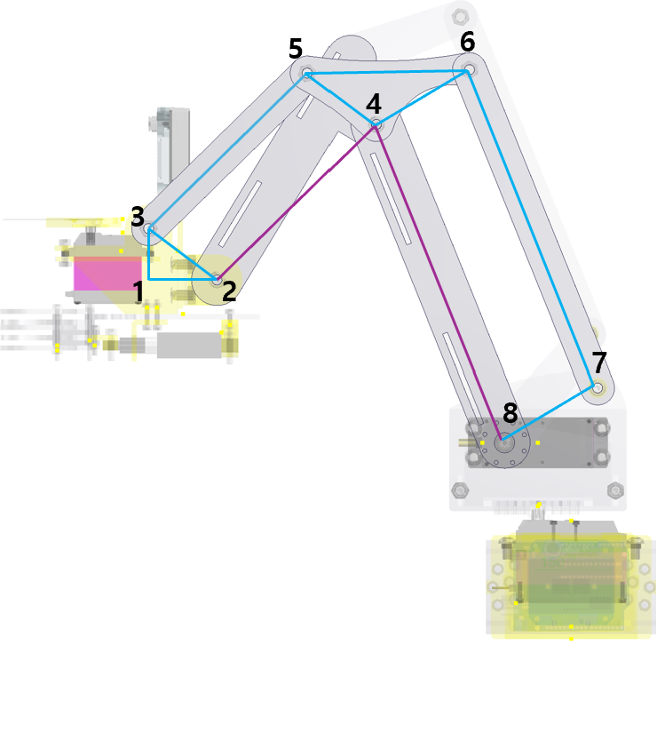

# Kinematic Analysis of a Parallelogram Linkage Robot Arm

<p align="center">
  
  
</p>

<p align="center">
  <b>Design, kinematic analysis, and circular trajectory simulation of a parallelogram linkage robot arm</b>
</p>

---

## Abstract

This project extends a conventional 2-DOF robot arm with a parallelogram linkage structure.  
The linkage allows the end-effector to maintain a constant orientation while following a circular trajectory in the y-z plane.

The desired trajectory coordinates are converted into shoulder and elbow motor angles through kinematic analysis.

$$
(y_d(\alpha),z_d(\alpha)) \rightarrow (\beta_1(\alpha),\beta_2(\alpha))
$$

The simulation verifies that the end-effector traces a circular path while maintaining a constant orientation.

$$
\theta_{EE} = \pi - C_3
$$

---

## Project Overview

This project consists of three parts.

1. **Mechanical Design**  
   Design of a 2-DOF robot arm extended with a parallelogram linkage.

2. **Kinematic Analysis**  
   Conversion of the target coordinate into shoulder and elbow motor angles.

3. **Circular Trajectory Simulation**  
   MATLAB simulation to verify whether the end-effector can trace a circular trajectory while maintaining its orientation.

---

## Part 1. Mechanical Design

<p align="center">
  
</p>

<p align="center">
  <b>Fig. 1. CAD model of the robot arm</b>
</p>

The robot arm is based on a conventional 2-DOF planar robot arm.  
A parallelogram linkage is added to maintain the end-effector orientation during motion.

---

## Part 2. Kinematic Analysis

The target position is defined in the y-z plane and converted into two motor angles.

$$
(y,z) \rightarrow (\beta_1,\beta_2)
$$

<p align="center">
  
</p>

<p align="center">
  <b>Fig. 2. Angle definition in the front-left configuration</b>
</p>

<p align="center">
  
</p>

<p align="center">
  <b>Fig. 3. Angle definition in the front-right configuration</b>
</p>

---

### Variable Definition

| Variable | Description |
|---|---|
| `y, z` | Target end-effector coordinate |
| `yd, zd` | Desired circular trajectory coordinate |
| `yc, zc` | Center of the circular trajectory |
| `R` | Radius of the circular trajectory |
| `α` | Circular trajectory parameter |
| `L1, L2` | Effective link lengths |
| `β1` | Shoulder motor angle |
| `β2` | Elbow motor angle |
| `θ1 ~ θ6` | Internal linkage angles |
| `C1 ~ C4` | Constant geometric angles |
| `θEE` | End-effector orientation angle |

All angles are expressed in radians.

---

### Coordinate-to-Angle Conversion

$$
P(y,z)
$$

$$
r^2 = y^2 + z^2
$$

$$
C = {y^2 + z^2 - L_1^2 - L_2^2 \over 2L_1L_2}
$$

$$
t_2 = cos^{-1}(C)
$$

$$
k_1 = L_1 + L_2C
$$

$$
k_2 = L_2\sqrt{1-C^2}
$$

$$
\beta_1 = atan2(z,y) - atan2(k_2,k_1)
$$

$$
\beta_1 = atan2(z,y) - atan2(L_2\sqrt{1-C^2},L_1+L_2C)
$$

---

### Motor Angle Relationship

$$
\theta_2 = C_4
$$

$$
\theta_1 = \theta_2 - t_2
$$

$$
\theta_1 = C_4 - t_2
$$

$$
\beta_2 = \beta_1 + \theta_1
$$

$$
\beta_2 = \beta_1 + C_4 - t_2
$$

$$
\beta_2 = atan2(z,y) - atan2(L_2\sqrt{1-C^2},L_1+L_2C) + C_4 - cos^{-1}(C)
$$

$$
(y,z) \rightarrow (\beta_1,\beta_2)
$$

---

### End-effector Orientation Constraint

$$
\theta_4 = C_1
$$

$$
\beta_1 + (\pi - \theta_3) = C_2
$$

$$
\beta_1 = \theta_3 + C_2 - \pi
$$

$$
\beta_3 = \theta_5 - \theta_6
$$

$$
t_2 = 2\pi - (\theta_3 + \theta_4 + \theta_5)
$$

$$
\beta_1 + \beta_3 + t_2 = \pi
$$

$$
\beta_1 + (\theta_5 - \theta_6) + 2\pi - (\theta_3 + \theta_4 + \theta_5) = \pi
$$

$$
\theta_6 = \beta_1 - \theta_3 - \theta_4 + \pi
$$

$$
\theta_6 = (\theta_3 + C_2 - \pi) - \theta_3 - C_1 + \pi
$$

$$
\theta_6 = C_2 - C_1
$$

$$
\theta_6 = C_3
$$

The end-effector orientation angle is defined as

$$
\theta_{EE} = \pi - \theta_6
$$

$$
\theta_{EE} = \pi - C_3
$$

---

### Final Kinematic Result

$$
(y,z) \rightarrow (\beta_1,\beta_2)
$$

$$
\beta_1 = Shoulder\ Motor\ Angle
$$

$$
\beta_2 = Elbow\ Motor\ Angle
$$

$$
\theta_{EE} = \pi - C_3
$$

---

## Part 3. Circular Trajectory Simulation

The MATLAB simulation verifies whether the end-effector can trace a circular trajectory in the y-z plane.

The desired circular trajectory is defined as

$$
P_d(\alpha) = (y_d(\alpha),z_d(\alpha))
$$

$$
y_d(\alpha) = y_c + R cos(\alpha)
$$

$$
z_d(\alpha) = z_c + R sin(\alpha)
$$

Each point on the circular trajectory is converted into motor angles using the derived kinematic equations.

$$
(y_d(\alpha),z_d(\alpha)) \rightarrow (\beta_1(\alpha),\beta_2(\alpha))
$$

The calculated motor angles are applied to the linkage model, and the end-effector traces the circular path while maintaining a constant orientation.

$$
\theta_{EE} = \pi - C_3
$$

---

### Simulation Structure

The MATLAB simulation was constructed using the linkage points and geometric constraints of the mechanism.  
The numbered points represent the joints used in the simulation model.

<p align="center">
  
</p>

<p align="center">
  <b>Fig. 4. Simulation linkage structure in the front-left configuration</b>
</p>

<p align="center">
  
</p>

<p align="center">
  <b>Fig. 5. Simulation linkage structure in the front-right configuration</b>
</p>

---

### Simulation Result

<p align="center">
  
</p>

<p align="center">
  <b>Fig. 6. End-effector circular trajectory simulation</b>
</p>

The simulation shows that the end-effector follows the circular trajectory generated in the y-z plane.

---

## Result

The target circular trajectory is generated in the y-z plane.

$$
P_d(\alpha) = (y_d(\alpha),z_d(\alpha))
$$

Each point of the trajectory is converted into shoulder and elbow motor angles.

$$
(y_d(\alpha),z_d(\alpha)) \rightarrow (\beta_1(\alpha),\beta_2(\alpha))
$$

The simulation confirms that the end-effector traces a circular path.

During the circular motion, the parallelogram linkage keeps the end-effector orientation constant.

$$
\theta_{EE} = \pi - C_3
$$

---

## Conclusion

This project demonstrates that a conventional 2-DOF robot arm can be extended with a parallelogram linkage to maintain a constant end-effector orientation.

The derived kinematic equations convert the desired circular trajectory coordinates into shoulder and elbow motor angles.

$$
(y_d(\alpha),z_d(\alpha)) \rightarrow (\beta_1(\alpha),\beta_2(\alpha))
$$

The MATLAB simulation verifies that the end-effector can trace a circular path while maintaining a constant orientation.

$$
\theta_{EE} = \pi - C_3
$$

---

## File Structure

```text
Parallelogram-Linkage-Robot-Arm/
├── README.md
├── cad_model.png
├── front_left_angle_definition.png
├── front_right_angle_definition.png
├── simulation_structure_left.png
├── simulation_structure_right.png
├── demo.gif
└── matlab/
    └── robot_kinematics_simulation.m
```
