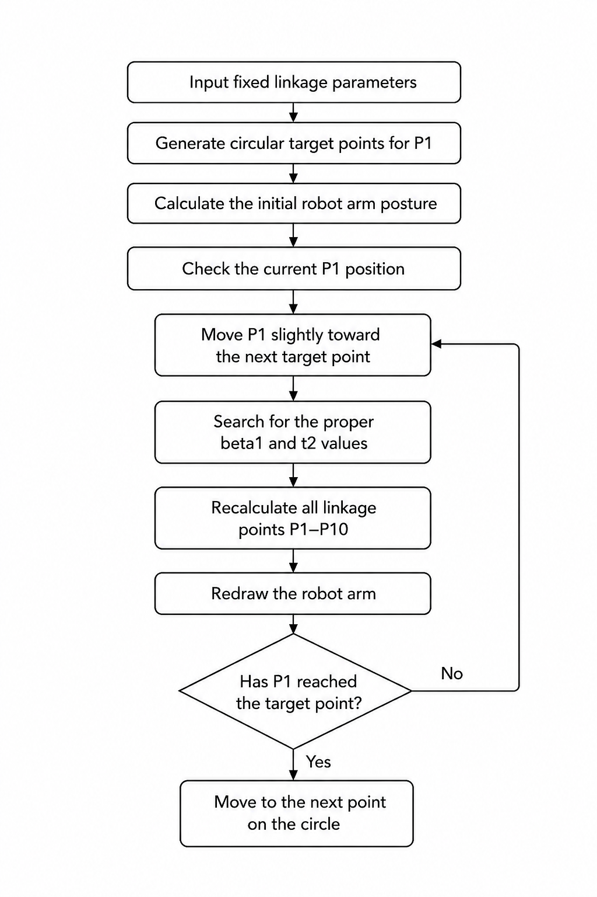

# Kinematic Analysis of a Parallelogram Linkage Robot Arm

  
  

  <b>Design, kinematic analysis, and circular trajectory simulation of a parallelogram linkage robot arm</b>

---

## Abstract

This project extends a conventional 2-DOF robot arm with a parallelogram linkage structure.
The linkage allows the end-effector to maintain a constant orientation while following a circular trajectory.

The desired trajectory coordinates are converted into shoulder and elbow motor angles through kinematic analysis.

$$
P_d(\theta) = (x_d(\theta), y_d(\theta))
$$

$$
P_d(\theta) \rightarrow (\beta_1(\theta),\beta_2(\theta))
$$

The simulation verifies that the end-effector traces a circular path while maintaining a constant orientation.

$$
\theta_{EE} = \pi - C_3
$$

---

## Project Overview

This project consists of three parts.

1. **Mechanical Design**
   Design of a 2-DOF robot arm extended with a parallelogram linkage.

2. **Kinematic Analysis**
   Conversion of the target coordinate into shoulder and elbow motor angles.

3. **Circular Trajectory Simulation**
   MATLAB simulation to verify whether the end-effector can trace a circular trajectory while maintaining its orientation.

---

## Part 1. Mechanical Design

  

  <b>Fig. 1. CAD model of the robot arm</b>

The robot arm is based on a conventional 2-DOF planar robot arm.
A parallelogram linkage is added to maintain the end-effector orientation during motion.

---

## Part 2. Kinematic Analysis

The target position is defined in the planar coordinate system and converted into two motor angles.

$$
(x,y) \rightarrow (\beta_1,\beta_2)
$$

  

  <b>Fig. 2. Angle definition in the front-left configuration</b>

  

  <b>Fig. 3. Angle definition in the front-right configuration</b>

---

### Variable Definition

| Variable  | Description                            |
| --------- | -------------------------------------- |
| `x, y`    | Target end-effector coordinate         |
| `xd, yd`  | Desired circular trajectory coordinate |
| `xc, yc`  | Center of the circular trajectory      |
| `R`       | Radius of the circular trajectory      |
| `θ`       | Circular trajectory parameter          |
| `L1, L2`  | Effective link lengths                 |
| `β1`      | Shoulder motor angle                   |
| `β2`      | Elbow motor angle                      |
| `θ1 ~ θ6` | Internal linkage angles                |
| `C1 ~ C4` | Constant geometric angles              |
| `θEE`     | End-effector orientation angle         |

All angles are expressed in radians unless otherwise specified.

---

### Coordinate-to-Angle Conversion

$$
P(x,y)
$$

$$
r^2 = x^2 + y^2
$$

$$
C = {x^2 + y^2 - L_1^2 - L_2^2 \over 2L_1L_2}
$$

$$
t_2 = cos^{-1}(C)
$$

$$
k_1 = L_1 + L_2C
$$

$$
k_2 = L_2\sqrt{1-C^2}
$$

$$
\beta_1 = atan2(y,x) - atan2(k_2,k_1)
$$

$$
\beta_1 = atan2(y,x) - atan2(L_2\sqrt{1-C^2},L_1+L_2C)
$$

---

### Motor Angle Relationship

The shoulder motor angle is obtained from inverse kinematics.

$$
\beta_1 = atan2(y,x) - atan2(L_2\sqrt{1-C^2},L_1+L_2C)
$$

The elbow motor angle is determined by the closed-loop linkage relationship.

$$
\theta_2 = C_4
$$

$$
\theta_1 = \theta_2 - t_2
$$

$$
\theta_1 = C_4 - t_2
$$

$$
\beta_2 = \beta_1 + \theta_1
$$

$$
\beta_2 = \beta_1 + C_4 - t_2
$$

$$
\beta_2 = atan2(y,x) - atan2(L_2\sqrt{1-C^2},L_1+L_2C) + C_4 - cos^{-1}(C)
$$

$$
(x,y) \rightarrow (\beta_1,\beta_2)
$$

---

### End-effector Orientation Constraint

$$
\theta_4 = C_1
$$

$$
\beta_1 + (\pi - \theta_3) = C_2
$$

$$
\beta_1 = \theta_3 + C_2 - \pi
$$

$$
\beta_3 = \theta_5 - \theta_6
$$

$$
t_2 = 2\pi - (\theta_3 + \theta_4 + \theta_5)
$$

$$
\beta_1 + \beta_3 + t_2 = \pi
$$

$$
\beta_1 + (\theta_5 - \theta_6) + 2\pi - (\theta_3 + \theta_4 + \theta_5) = \pi
$$

$$
\theta_6 = \beta_1 - \theta_3 - \theta_4 + \pi
$$

$$
\theta_6 = (\theta_3 + C_2 - \pi) - \theta_3 - C_1 + \pi
$$

$$
\theta_6 = C_2 - C_1
$$

$$
\theta_6 = C_3
$$

The end-effector orientation angle is defined as

$$
\theta_{EE} = \pi - \theta_6
$$

$$
\theta_{EE} = \pi - C_3
$$

---

### Final Kinematic Result

$$
(x,y) \rightarrow (\beta_1,\beta_2)
$$

$$
\beta_1 = Shoulder\ Motor\ Angle
$$

$$
\beta_2 = Elbow\ Motor\ Angle
$$

$$
\theta_{EE} = \pi - C_3
$$

---

## Part 3. Circular Trajectory Simulation

The MATLAB simulation verifies whether the end-effector can trace a circular trajectory in the X-Y plane.

The circular target points for P1 are generated as

$$
P_d(\theta) = (x_d(\theta),y_d(\theta))
$$

$$
x_d(\theta) = x_c + R\cos(\theta)
$$

$$
y_d(\theta) = y_c + R\sin(\theta)
$$

where the circle center is

$$
(x_c,y_c) = (-300,0)\ \text{mm}
$$

and the radius is

$$
R = 50\ \text{mm}
$$

In the MATLAB implementation, `theta` is expressed in degrees, so `cosd(theta)` and `sind(theta)` are used.

For each circular target point, P1 is moved incrementally toward the target position.
At each step, the simulation searches for the proper `beta1` and `t2` values using an optimization-based cost function.

After the proper `beta1` and `t2` values are found, all linkage points from P1 to P10 are recalculated and the robot arm is redrawn.

---

### Simulation Flowchart

The simulation follows the procedure shown below.
First, the fixed linkage parameters are defined and the circular target points for P1 are generated.

Then, for each target point, P1 is moved gradually toward the target position.
At every incremental movement, the simulation searches for the proper `beta1` and `t2` values that satisfy the linkage geometry.

After that, all linkage points from P1 to P10 are recalculated and the robot arm is redrawn.
The process is repeated until P1 reaches the current target point.
Then, the simulation moves to the next point on the circle.

  

  <b>Fig. 4. Simulation flowchart for circular trajectory tracking</b>

---

### Simulation Structure

The MATLAB simulation was constructed using the linkage points and geometric constraints of the mechanism.
The numbered points represent the joints used in the simulation model.

  

  <b>Fig. 5. Simulation linkage structure in the front-left configuration</b>

  

  <b>Fig. 6. Simulation linkage structure in the front-right configuration</b>

---

### Simulation Result

  

  <b>Fig. 7. End-effector circular trajectory simulation</b>

The simulation shows that P1 follows the generated circular trajectory.

---

## Result

The target circular trajectory is generated in the X-Y plane.

$$
P_d(\theta) = (x_d(\theta),y_d(\theta))
$$

Each point of the trajectory is used as a target position for P1.

For each target point, the simulation searches for the proper `beta1` and `t2` values that satisfy the linkage geometry.

The simulation confirms that P1 traces a circular path.

During the circular motion, the parallelogram linkage keeps the end-effector orientation constant.

$$
\theta_{EE} = \pi - C_3
$$

---

## Conclusion

This project demonstrates that a conventional 2-DOF robot arm can be extended with a parallelogram linkage to maintain a constant end-effector orientation.

The circular trajectory coordinates are generated and used as target positions for P1.

$$
P_d(\theta) = (x_d(\theta),y_d(\theta))
$$

The MATLAB simulation verifies that the robot arm can trace a circular path while maintaining a constant end-effector orientation.

$$
\theta_{EE} = \pi - C_3
$$
