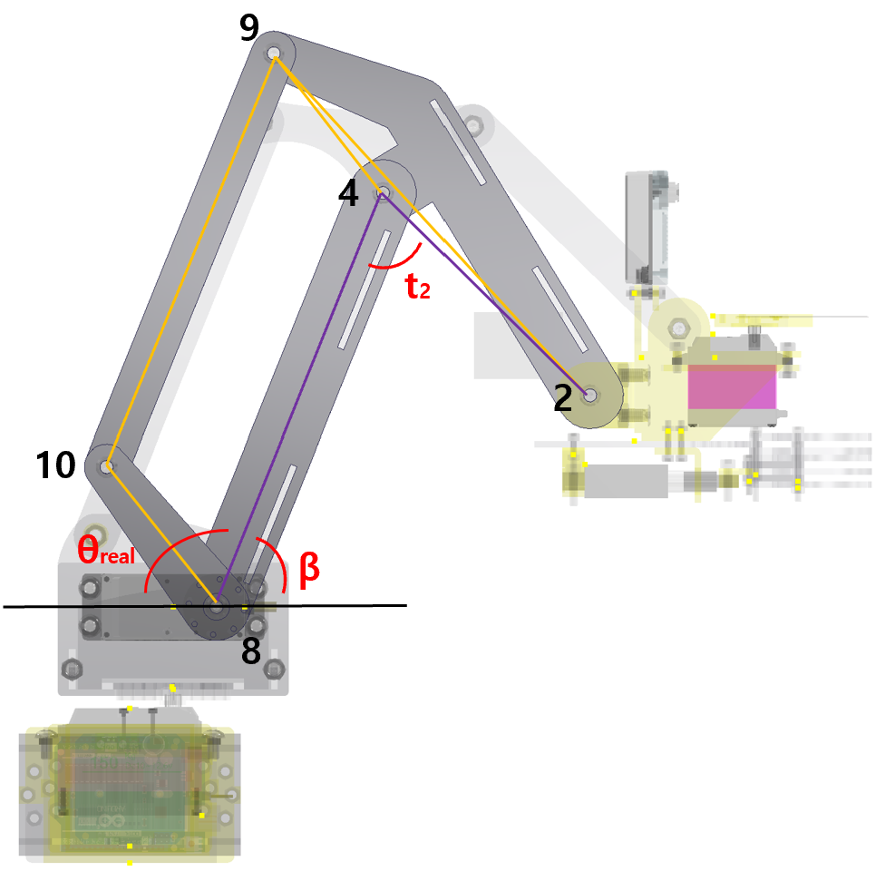
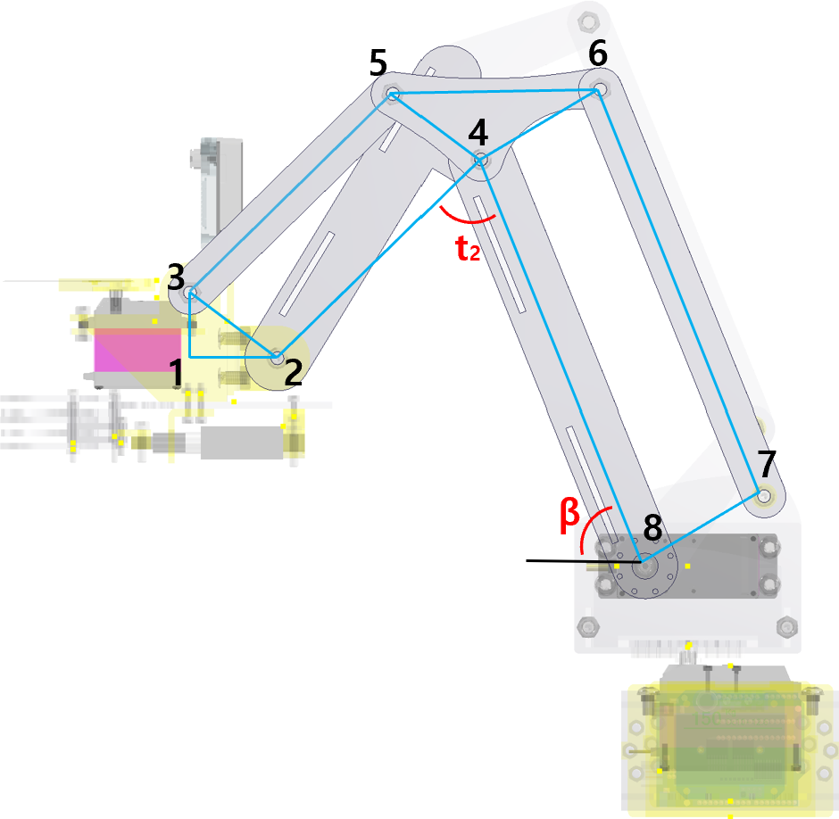

# Ground-Parallel End-Effector Robotic Arm Simulation

**MATLAB Kinematic Simulation of a Custom 2D Linkage Mechanism**

*Ground-parallel end-effector mechanism for a harvesting robot arm.*

---

<table>
<tr>
<td width="45%" align="center" valign="middle">

<h3>CAD Model</h3>

</td>
<td width="55%" valign="middle">

<h3>Key Features</h3>

- End-effector is defined as **Link 1–2**
- Maintains a ground-parallel end-effector posture during motion
- Custom robotic arm mechanism modeled in CAD
- 2D linkage simplification for kinematic simulation
- Inverse-kinematics-based posture calculation
- MATLAB kinematic simulation and animation
- Designed for a harvesting robot arm mechanism

</td>
</tr>
</table>

The mechanism was designed for a harvesting robot arm, and the main objective of this simulation is to verify whether the end-effector link remains parallel to the ground during motion.

---

<h2 align="center">2D Linkage Model & Inverse Kinematics</h2>

<table>
<tr>
<td width="50%" align="center" valign="middle">

</td>
<td width="50%" align="center" valign="middle">

$$r^2=y^2+z^2$$

$$c_2=\frac{r^2-L_1^2-L_2^2}{2L_1L_2}$$

$$t_2=\cos^{-1}(c_2)$$

$$k_1=L_1+L_2c_2$$

</td>
</tr>

<tr>
<td width="50%" align="center" valign="middle">

</td>
<td width="50%" align="center" valign="middle">

$$k_2=L_2\sqrt{1-c_2^2}$$

$$\beta=\arctan\left(\frac{z}{y}\right)-\arctan\left(\frac{k_2}{k_1}\right)$$

$$\theta_1=\theta_2-t_2$$

$$abs_2=\beta+\theta_1$$

</td>
</tr>
</table>

---

<h2 align="center">MATLAB Simulation</h2>

The MATLAB animation verifies that the modeled robotic arm moves while maintaining the end-effector link parallel to the ground.

---

## Files

- `robotic.m` : Main MATLAB simulation code
- `demo.mp4` : MATLAB simulation video
- `cad_model.png` : CAD model image
- `mechanism_1.png`, `mechanism_2.png` : 2D linkage model images
